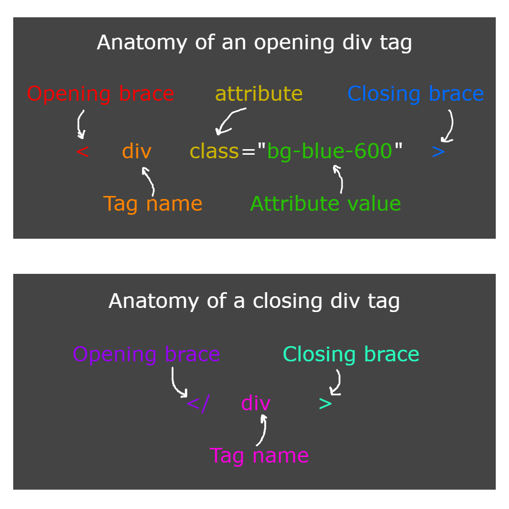

# Let's learn about HTML

## Course Module 1: The Basics of HTML

### Part 1: The Foundation of the Internet

HTML, or HyperText Markup Language, is considered the skeleton of the entire internet. It's the basic structure that all web pages are built on. This might seem like a big statement, but when you delve into HTML, you'll understand that it's actually constructed from just 145 simple words, known as 'tags'. 

### Part 2: Understanding HTML Tags

In HTML, every tag is enclosed within less than and greater than signs, like so: `<tagname>`. This is known as an opening tag. Most tags will also include a corresponding closing tag, formatted with a forward slash before the tag name: `</tagname>`. 

Each usage of a tag in HTML is referred to as an 'element'. These elements are what you see when you browse a website. While the terminology might be confusing initially, it will become clear as we progress. In a nutshell, remember that a 'tag' refers to the textual representation, while an 'element' is the actual component you see on the website.

### Part 3: Tag Attributes

HTML tags can also have 'attributes', which are additional properties specified within the opening tag. These attributes are key in customizing the function and appearance of HTML elements. An example is the 'type' attribute in an input tag that specifies whether it's a regular button or a submit button. For an exhaustive list of attributes, refer to the [Mozilla Developer Network](https://developer.mozilla.org/en-US/).

### Part 4: Essential HTML Tags

Although there are 145 tags, you'll only need a handful to start building a functional website. 

- `<!DOCTYPE html>`: This tag is always at the very top of your HTML files and instructs the browser to render the content according to standard HTML rules. 

- `<html></html>`: This tag encapsulates all the content of your website. Only the DOCTYPE tag resides outside of it. 

- `<head></head>`: This tag houses the metadata, providing the browser with information about your page. It's placed inside the top of the `<html>` tag.

- `<title></title>`: While optional, this tag is highly recommended. It specifies the text to display on the browser tab. It should be nested within the `<head>` tags. 

- `<body></body>`: This tag encompasses the actual content of your webpage - everything the users can see and interact with. It is placed directly after the `<head>` tag.

By implementing these tags, you essentially have a functional website that can be hosted and displayed on the internet.

**Part 5: Common Display Tags**

As you get started with HTML, you'll frequently use these display tags:

- `

`: Known as the division tag, it separates and styles elements. It primarily acts as a container for other tags or text.

- `

`: The paragraph tag is used to define text paragraphs. Browsers usually apply default spacing for these tags.

- `<h1></h1>`: This is the heading tag, influencing the size of enclosed text. Numbers 1-6 can be used to denote different heading levels, with 'h1' being the main point and 'h6' the smallest sub-point.

- ``: This tag embeds an image. It needs the 'src' attribute to specify the image source, like so: ``.

- ``: The anchor tag is used to create hyperlinks. The 'href' attribute specifies the destination URL, for instance, `<a href="https://www.samhuckaby.com">sam’s website</a>`.

- `<button></button>`: This creates a clickable button. Any text between the tags will be displayed on the button.

- `<input />`: This tag is used to create input fields where users can enter data. By default, it's a text field. However, the 'type' attribute can modify this to a variety of inputs like numbers, emails, etc.

While there are many more tags, the ones listed above make up about 95% of what you'll use in most web projects.

## Course Module 2: Advanced HTML Elements and Expanding Beyond HTML

### Part 1: Advanced HTML Elements

As you progress in your HTML journey, there are several advanced elements that you will use in specific scenarios. Often, these elements are styled or modified to achieve a unique appearance or functionality, deviating from their standard HTML look and feel.

- `<form></form>`: The form element encapsulates a logical unit of inputs. For example, if you're creating an app for Magic The Gathering (MTG) deck, you might have a form that collects deck details such as the name, description, price, and cards in the deck. When the form is submitted, all the input values are sent together to a location defined by the 'action' attribute, using the HTTP request method specified by the 'method' attribute.

- `<ul></ul>`: The 'unordered list' element, along with its counterpart, `<ol></ol>` (ordered list), provide HTML list functionality. Ordered lists are numbered, while unordered lists typically feature bullet points. Unordered lists are commonly styled into menus with CSS due to their inherent design of displaying list items next to each other.

- `<label></label>`: The label tag provides a name for an input element, usually within a form. Although it offers little visual benefit, it's recommended for accessibility purposes (commonly referred to as 'a11y'). A neat feature is that clicking on a label moves the focus to its associated input element.

### Part 2: Transitioning from HTML

HTML forms the backbone of any website, akin to the sculptor's clay. But relying solely on HTML will result in static, simplistic, and relatively unappealing websites. The true power of HTML emerges when it's combined with other technologies, such as CSS and JavaScript.

- `<link />`: The link tag, among its various uses, is essential for integrating stylesheets into your website. Stylesheets are CSS files that instruct the browser on how to display your tags. The link tag is placed in the `<head>` section of your website and requires two attributes: 'href' and 'rel'. An example would be: `<link href="path/to/stylesheet.css" rel="stylesheet" />`.

- `` or `<script src="" />`: The script tag is used to incorporate external files (predominantly JavaScript) into your website. This tag usually resides in the `<head>` section of the website, but it can also be placed at the bottom of the `<body>` section, causing the file to load simultaneously with the website content.

It's important to note that items added to the `<head>` are loaded into the browser's memory before the page is displayed to the user, while items in the `<body>` load as the page is displayed. While this loading process is generally fast, larger files may cause a noticeable delay.

In this course, we'll primarily load files into the `<head>` section as the necessary files are known beforehand, and we won't be dynamically generating anything.
