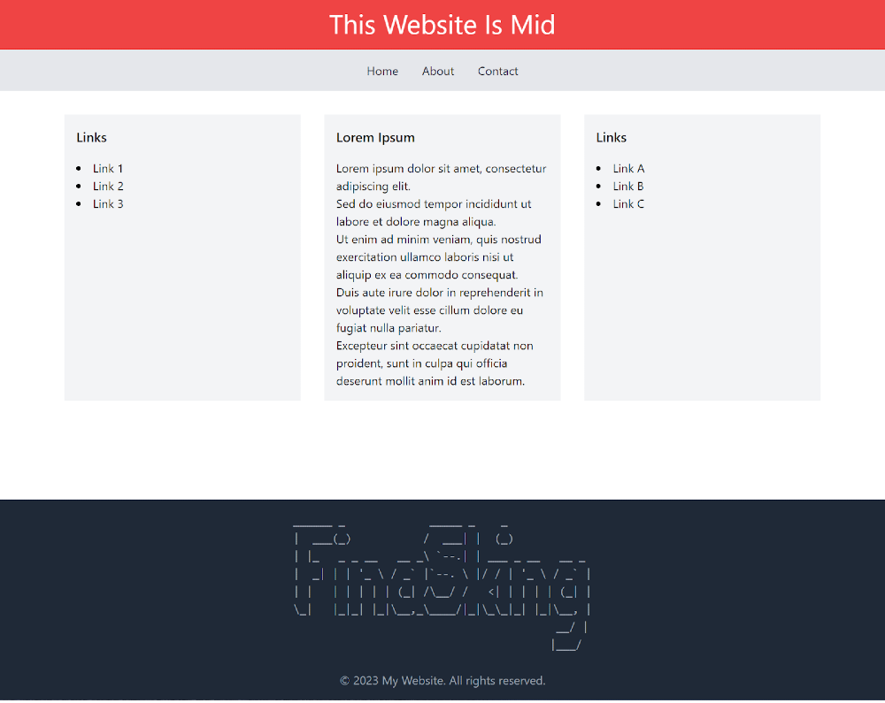

# Intro to CSS

If HTML is the skeleton of the web, then CSS is the mascara. CSS is specifically a “language” designed to help a browser interpret how HTML should look and feel. For example, if you want all of your quotes on your blog to have a slightly darker background and a different font, you would use CSS to do that.
Another more complicated example is building page structure. If you want a page that has a banner across the top, then a menu across the page directly under that, and then three columns with menus on either side and your content in the middle, with a nice footer that stretches across the whole page at the bottom, you would need CSS to tell the HTML to look like that. Here’s what it could look like:


CSS operates in a way that is nearly identical to how spell targeting works in Magic: The Gathering, so we’ll use that as a template for understanding what’s happening.
Each “selector” in CSS is a rule which will tell the browser which things on the page should get the styles in that rule. Once the browser determines which elements on the page will be getting those styles, it then takes all of the style details in the rule (things like text color, alignment, and opacity) and applies it to all elements that matched the rule.

## Selectors
### Element Selector
Let’s start with the element selector. This type of CSS selector targets all HTML elements of the same type on a page. It’s like casting a spell in Magic: The Gathering that affects all creatures of a certain type, like Humans or Goblins.

For example, if you have the CSS rule:

```
p {
    color: blue;
}
```
This rule is like casting a spell that gives all human creatures +1/+1. In the same way the spell affects all humans on the battlefield, the CSS rule affects all `<p>` elements on the web page by changing their text color to blue.

### Class Selector
Next, we have the class selector. This type of CSS selector targets HTML elements with a specific class attribute. It’s similar to casting a spell in Magic: The Gathering that affects all creatures belonging to a certain class or affiliation, like all creatures with a specific color identity.

For example, you could have the following CSS rule:

```
.mana-blue {
    color: blue;
}
```

In this case, all elements with the class `mana-blue` will have their text color changed to blue. This is akin to casting a spell that gives all creatures with a blue color identity +1/+1. Not all creatures are affected, only creatures with blue mana in their color identity are affected.

### ID Selector
Lastly, there’s the ID selector. This CSS selector targets a specific HTML element with a unique ID attribute. It’s like casting a spell in Magic: The Gathering that targets a specific legendary card, such as “Jace, Arcane Strategist”, because there can only be one of that card on the battlefield at a given time.

For example, the following CSS rule:

```
#jace {
    color: blue;
}
```

This CSS rule changes the text color to blue for the unique element with the ID `jace`. This is similar to a spell that specifically targets “Jace, Arcane Strategist”, affecting only this one specific planeswalker.

### Inline Styles
Inline styles in CSS are a lot like Aura enchantments in Magic: The Gathering. Just as an Aura enchantment is directly attached to a specific creature and can modify its properties (like giving it +1/+1 or granting it a special ability), an inline style is applied directly to an HTML element and can alter its properties.
For instance, the HTML code `<p style="color: blue;">This is a blue paragraph.</p>` is equivalent to casting an Aura enchantment on a specific creature, say “Goblin King”, to give it a new ability, such as making it unblockable. The style is applied only to this specific paragraph, and not to any other `<p>` elements on the page, much like how the Aura enchantment only affects the enchanted creature and not others of the same type.
Despite their powerful targeted impact, both inline styles and Aura enchantments should be used judiciously. Overuse of inline styles can lead to code that’s hard to maintain, much like a strategy overly reliant on Auras can be vulnerable to removal spells that could dismantle the strategy all at once.

### Selector Specificity
Now, let’s talk about specificity. In Magic: The Gathering, some spells can override or counter others based on their power level or the order in which they’re cast. In a similar vein, CSS has a concept of specificity, which determines which styles are applied when there’s a conflict.

The specificity hierarchy in CSS is as follows:
1. Inline styles: These styles are applied directly to the HTML element, making them the most specific. They’re akin to an instant spell that can be cast at any time to directly affect a creature or planeswalker, superseding any previous enchantments or conditions.
2. ID selectors: These are the second most specific selectors, like a spell targeting a specific planeswalker.
3. Class selectors: Class selectors, pseudo-classes and attribute selectors come next. They’re like spells that affect creatures based on a certain class or condition.
4. Element selectors: These are the least specific, akin to spells affecting all creatures of a certain type.

Here’s an example:

```
p {
    color: red;
}
.mana-blue {
    color: blue;
}
#jace {
    color: green;
}
```

In this case, an element with the ID `jace` and the class `mana-blue` will have green text, even though there are rules for `p` elements and `.mana-blue` elements to have red and blue text respectively. This is because the ID selector is more specific and overrides the others.

The order of priority goes like this

(Inline has the highest priority, element styles have the lowest priority):

Inline > ID > Class > element

These rules, much like the rules of Magic: The Gathering, define the interaction and cascading of styles in a web document, allowing for complex and intricate design possibilities.

## Using CSS
Where do you put this stuff, you might be asking. There are actually two answers to that question. You can either put them directly in the page (in the `<head>` section of the file) or you can put them in a separate css file that you link to your website using a `<link>` tag.

### Inline in `<head>`
The easiest way is to simply write them into your HTML document. An example of how you would style all paragraphs to have red text would look like this:

```
<!DOCTYPE html>
<html>
<head>
    <title>Red Paragraphs</title>
    <style>
        p {
            color: red;
        }
    </style>
</head>
<body>
    <p>This is a paragraph with red text.</p>
    <p>This is another paragraph with red text.</p>
</body>
</html>
```

### `<link>` Tags
If you were to write the above style but in a separate file, you could simple take the style definition `p { color: red; }` and put that in a file named something like `styles.css` located next to the HTML file (or wherever) and link it to the website using a `<link>` tag like so:

```
<!DOCTYPE html>
<html>
<head>
    <title>Red Paragraphs</title>
    <link rel="stylesheet" type="text/css" href="styles.css">
</head>
<body>
    <p>This is a paragraph with red text.</p>
    <p>This is another paragraph with red text.</p>
</body>
</html>
```

## CSS Glossary
Below you will find a list of 100 commonly-used CSS properties with a brief description of what each one does (provided by an AI). They are not alphabetically sorted, but you can search based on what you think you need. We’ll have to see if this can be refined to a more specific set and ordering later.

1. `color`: Sets the color of text.
2. `background-color`: Sets the background color of an element.
3. `background-image`: Sets one or more background images for an element.
4. `background-size`: Specifies the size of the background images.
5. `background-repeat`: Sets if/how a background image will be repeated.
6. `background-position`: Sets the starting position of a background image.
7. `background-attachment`: Sets whether a background image is fixed or scrolls with the rest of the page.
8. `font-family`: Specifies the font for text.
9. `font-size`: Sets the size of text.
10. `font-weight`: Sets the weight or thickness of the font.
11. `font-style`: Sets the style of the font (normal, italic, oblique).
12. `text-align`: Aligns the text in an element (left, right, center, or justify).
13. `text-decoration`: Specifies the decoration added to text (none, underline, overline, line-through).
14. `text-transform`: Controls the capitalization of text (none, capitalize, uppercase, lowercase).
15. `line-height`: Sets the height of line boxes.
16. `letter-spacing`: Increases or decreases the space between characters in text.
17. `word-spacing`: Increases or decreases the space between words.
18. `white-space`: Specifies how white-space inside an element is handled.
19. `direction`: Specifies the text direction/writing direction.
20. `width`: Sets the width of an element.
21. `height`: Sets the height of an element.
22. `max-width`: Sets the maximum width of an element.
23. `max-height`: Sets the maximum height of an element.
24. `min-width`: Sets the minimum width of an element.
25. `min-height`: Sets the minimum height of an element.
26. `margin`: Sets all the margin properties in one declaration.
27. `margin-top`: Sets the top margin of an element.
28. `margin-right`: Sets the right margin of an element.
29. `margin-bottom`: Sets the bottom margin of an element.
30. `margin-left`: Sets the left margin of an element.
31. `padding`: Sets all the padding properties in one declaration.
32. `padding-top`: Sets the top padding of an element.
33. `padding-right`: Sets the right padding of an element.
34. `padding-bottom`: Sets the bottom padding of an element.
35. `padding-left`: Sets the left padding of an element.
36. `border`: Sets all the border properties in one declaration.
37. `border-style`: Sets the style of the border.
38. `border-width`: Sets the width of the border.
39. `border-color`: Sets the color of the border.
40. `border-top`: Sets all the top border properties in one declaration.
41. `border-right`: Sets all the right border properties in one declaration.
42. `border-bottom`: Sets all the bottom border properties in one declaration.
43. `border-left`: Sets all the left border properties in one declaration.
44. `border-radius`: Defines the radius of the border corners.
45. `border-collapse`: Specifies whether the border of table is collapse or separate.
46. `box-shadow`: Applies shadow effects around the frame of an element.
47. `outline`: Sets all the outline properties in one declaration.
48. `outline-style`: Sets the style of the outline.
49. `outline-color`: Sets the color of the outline.
50. `outline-width`: Sets the width of the outline.
51. `display`: Specifies the display behavior of an element.
52. `position`: Specifies the type of positioning method used for an element.
53. `top`: Specifies the top position of an element.
54. `right`: Specifies the right position of an element.
55. `bottom`: Specifies the bottom position of an element.
56. `left`: Specifies the left position of an element.
57. `float`: Specifies whether or not an element should float.
58. `clear`: Specifies which sides of an element where other floating elements are not allowed.
59. `z-index`: Specifies the stack order of an element.
60. `overflow`: Specifies what happens if content overflows an element's box.
61. `clip`: Defines the visible portion of an element.
62. `visibility`: Specifies whether an element is visible.
63. `cursor`: Specifies the mouse cursor to be displayed when pointing over an element.
64. `opacity`: Sets the opacity level for an element.
65. `filter`: Defines effects (like blur and saturation) for an element.
66. `list-style`: Sets all the list properties in one declaration.
67. `list-style-type`: Sets the type of list-item marker.
68. `list-style-position`: Specifies the position of the list-item markers (bullets, numbers, etc.).
69. `list-style-image`: Specifies an image as the list-item marker.
70. `content`: Used with the :before and :after pseudo-elements, to insert generated content.
71. `vertical-align`: Sets the vertical alignment of an element.
72. `transition`: Shorthand property for setting the four transition properties.
73. `transition-property`: Specifies the name of the CSS property the transition effect is for.
74. `transition-duration`: Specifies how many seconds or milliseconds a transition effect takes to complete.
75. `transition-timing-function`: Specifies the speed curve of the transition effect.
76. `transition-delay`: Specifies when the transition effect will start.
77. `transform`: Applies a 2D or 3D transformation to an element.
78. `transform-origin`: Allows you to change the position on transformed elements.
79. `animation`: Shorthand property for all the animation properties.
80. `animation-name`: Specifies a name for the @keyframes animation.
81. `animation-duration`: Specifies how long time an animation should take to complete.
82. `animation-timing-function`: Specifies the speed curve of the animation.
83. `animation-delay`: Specifies when the animation will start.
84. `animation-iteration-count`: Specifies the number of times an animation should be played.
85. `animation-direction`: Specifies whether the animation should play in reverse direction or alternate cycles.
86. `animation-fill-mode`: Specifies what values are applied by the animation outside the time it is executing.
87. `flex`: Shorthand property for setting the flex-grow, flex-shrink, and the flex-basis.
88. `flex-direction`: Specifies the direction of the flexible items.
89. `flex-wrap`: Specifies whether the flexible items should wrap or not.
90. `justify-content`: Aligns the flexible container's items when the items do not use all available space on the main-axis.
91. `align-items`: Specifies the default alignment for items inside the flexible container.
92. `align-content`: Modifies the behavior of the flex-wrap property.
93. `grid`: Shorthand property for grid-template-rows, grid-template-columns, grid-template-areas, grid-auto-rows, grid-auto-columns, and grid-auto-flow.
94. `grid-column`: Specifies a grid item’s size and location in a grid layout.
95. `grid-row`: Determines a grid item’s location within the grid row by contributing a line, a span, or nothing (automatic).
96. `gap`: Shorthand for row-gap and column-gap specifying the sizes of grid gaps.
97. `row-gap`: Specifies the size to be used as a horizontal gap between grid rows.
98. `column-gap`: Specifies the size to be used as a vertical gap between grid columns.
99. `justify-items`: Aligns grid items along the inline (row) axis.
100. `align-items`: Aligns grid items along the block (column) axis.


